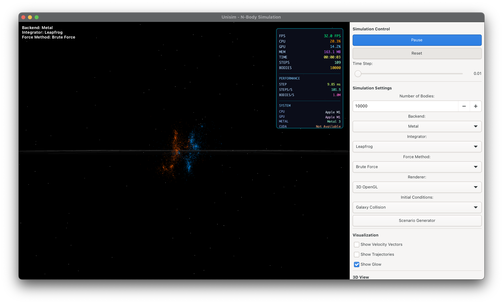

# Unisim - N-Body Physics Simulation

A high-performance n-body physics simulation application built with C++ and GTK4. Simulate gravitational interactions between thousands of bodies using various numerical integrators and force computation methods.



## Features

- **Multiple Integrators**: Euler, Verlet, Leapfrog, Runge-Kutta (RK4)
- **Force Computation**: Brute Force (O(N²)), Barnes-Hut (O(N log N)), Fast Multipole (O(N))
- **Rendering**: 2D top-down, 3D, and 3D OpenGL views
- **Initial Conditions**: Random, Spiral Galaxy, Elliptical Galaxy, Galaxy Collision, Solar System, Binary Star System
- **Compute Backends**: CPU (always available), Metal (macOS), CUDA (optional)

## Prerequisites

### macOS

```bash
brew install gtk4
```

### Linux

Install GTK4 development packages using your distribution's package manager:

```bash
# Ubuntu/Debian
sudo apt-get install libgtk-4-dev libepoxy-dev

# Fedora
sudo dnf install gtk4-devel libepoxy-devel
```

### Requirements

- CMake 3.10 or higher
- C++17 compatible compiler
- pkg-config

## Building

```bash
mkdir build
cd build
cmake ..
make
```

The executable `unisim` will be created in the `build/` directory.

### Optional: CUDA Support

If CUDA is installed and detected by CMake, it will be automatically enabled. The CUDA backend will appear as an option in the UI if available.

## Running

From the build directory:

```bash
./unisim
```

Or from any directory:

```bash
/path/to/build/unisim
```

## Operation Instructions

### Basic Controls

- **Play/Pause Button**: Start or pause the simulation
- **Reset Button**: Regenerate initial conditions with current settings
- **Reset Camera**: Reset the viewport to default position and zoom

### Simulation Parameters

- **Number of Bodies**: Adjust the number of simulated bodies (affects performance)
- **Time Step (dt)**: Control simulation time step (smaller = more accurate, slower)

### Backend Selection

Choose the compute backend:

- **CPU**: Standard CPU computation (always available)
- **Metal**: GPU acceleration on macOS (if available)
- **CUDA**: GPU acceleration on systems with NVIDIA GPUs (if available)

### Integrator Selection

Choose a numerical integration method:

- **Euler**: Simple first-order method (fast, less accurate)
- **Verlet**: Second-order symplectic method (good energy conservation)
- **Leapfrog**: Second-order symplectic method (velocity-centered)
- **Runge-Kutta (RK4)**: Fourth-order method (accurate, slower)

### Force Method Selection

Choose how gravitational forces are computed:

- **Brute Force**: O(N²) - Accurate but slow for many bodies
- **Barnes-Hut**: O(N log N) - Tree-based approximation, faster for large N
- **Fast Multipole**: O(N) - Multipole expansion method, fastest for very large N

### Renderer Selection

Choose the visualization mode:

- **2D**: Top-down or side view projection
- **3D**: Simple 3D rendering
- **3D OpenGL**: Hardware-accelerated 3D rendering (recommended)

### Initial Conditions

Select the starting configuration:

- **Random**: Random distribution of bodies
- **Spiral Galaxy**: Simulated spiral galaxy formation
- **Elliptical Galaxy**: Elliptical galaxy configuration
- **Galaxy Collision**: Two galaxies colliding
- **Solar System**: Our solar system simulation
- **Binary Star System**: Binary star orbit

### View Options (3D OpenGL)

- **Show Vectors**: Display velocity vectors
- **Show Trajectories**: Show body path trails
- **Show Glow**: Add glow effect to bodies
- **Show Starfield**: Display background starfield
- **Show Grid**: Display reference grid
- **Body Size**: Adjust body rendering size
- **Grid Width**: Adjust grid spacing

### Scenario Generator

Use the "Scenario Generator" button to create custom scenarios with preset parameters for different initial conditions.

### Camera Controls (3D View)

- **Mouse Drag**: Rotate camera around the simulation
- **Scroll Wheel**: Zoom in/out
- **Right-Click Drag**: Pan the view

## Testing

Run the physics regression tests:

```bash
cd build
ctest
```

Or run the test directly:

```bash
./build/physics_regression
```

## Performance Tips

- Use **Barnes-Hut** or **Fast Multipole** for simulations with >1000 bodies
- **Verlet** integrator provides a good balance of speed and accuracy
- **Metal** backend (macOS) significantly improves performance for large simulations
- Reduce **Time Step** for better accuracy with fast-moving bodies
- Lower **Number of Bodies** if the simulation runs slowly

## Architecture

For detailed architecture documentation, see [ARCHITECTURE.md](ARCHITECTURE.md).

## Project Structure

```
src/
├── simulation/        # Core physics (Vector3D, Body, Universe)
├── integrators/       # Numerical integrators
├── force_computers/   # Force computation methods
├── rendering/         # Visualization renderers
├── initial_conditions/# Initial condition generators
├── compute/          # Compute backends (CPU, GPU)
└── ui/               # GTK4 user interface
```

## Disclaimer

I vibecoded this.

## License

MIT
